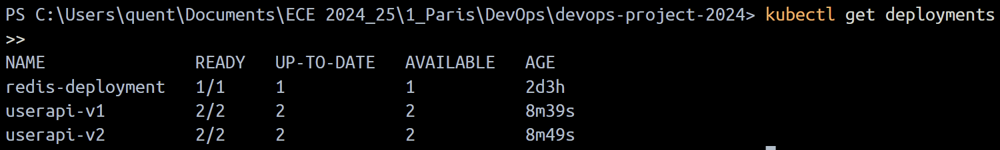
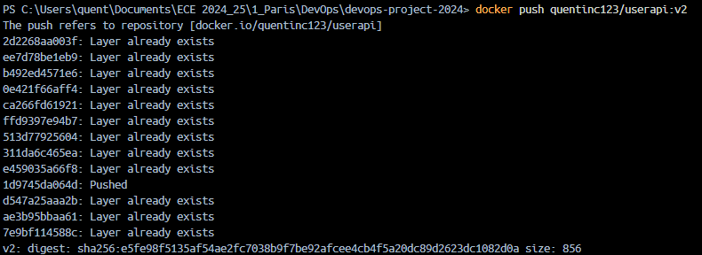
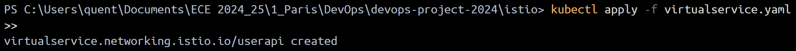
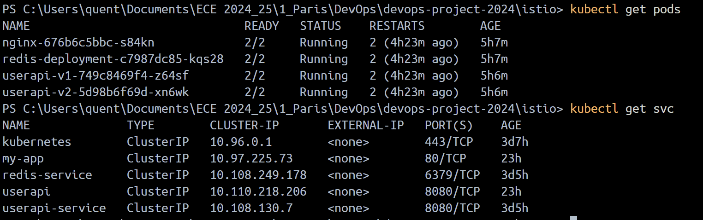
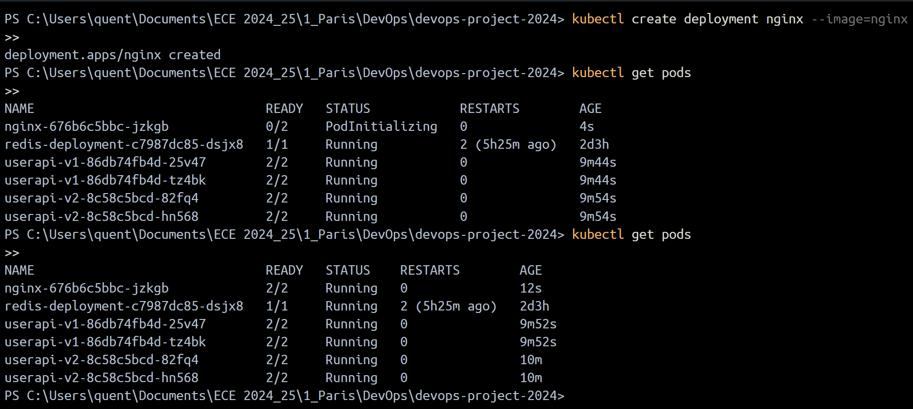

# DevOps Project 2024

## 📑 Table des matières
1. [Introduction](#introduction)
2. [Prérequis](#prérequis)
3. [Installation](#installation)
4. [Les 7 Composants](#les-7-composants)
   - [Application Web](#1-application-web)
   - [CI/CD Pipeline](#2-cicd-pipeline)
   - [Infrastructure as Code](#3-infrastructure-as-code)
   - [Docker](#4-docker)
   - [Docker Compose](#5-docker-compose)
   - [Kubernetes](#6-kubernetes)
   - [Service Mesh avec Istio](#7-service-mesh-avec-istio)
5. [Structure du Projet](#-structure-du-projet)
6. [Liens](#-liens)
7. [Auteurs](#-auteurs)

## 🚀 Introduction

Dans le cadre de notre formation à l'ECE Paris, nous avons développé un projet DevOps complet qui met en œuvre les meilleures pratiques de l'industrie. Ce projet consiste en une API REST de gestion d'utilisateurs, construite avec Node.js et Redis, et déployée à travers une chaîne DevOps complète.

Notre objectif était de créer une application moderne qui démontre l'utilisation des technologies DevOps essentielles : du développement au déploiement, en passant par la conteneurisation et l'orchestration. Nous avons mis l'accent sur l'automatisation, la scalabilité et la maintenabilité du code.

## ⚡ Prérequis

Pour exécuter ce projet dans son intégralité, vous aurez besoin des éléments suivants installés sur votre machine :

- **Node.js (v16 ou supérieur)**
  - Environnement d'exécution JavaScript
  - npm pour la gestion des dépendances

- **Redis**
  - Base de données en mémoire
  - Utilisée pour le stockage des données utilisateurs

- **Docker & Docker Compose**
  - Docker pour la conteneurisation
  - Docker Compose pour l'orchestration locale

- **Kubernetes (Minikube)**
  - Orchestrateur de conteneurs
  - Minikube pour le développement local

- **Istio**
  - Service Mesh pour Kubernetes
  - Gestion avancée du trafic

- **Vagrant & VirtualBox**
  - Vagrant pour la gestion des VM
  - VirtualBox comme hyperviseur

## 🔧 Installation

Nous avons conçu le processus d'installation pour être aussi simple et automatisé que possible. Voici les étapes détaillées :

1. **Cloner le repository**
   ```bash
   git clone https://github.com/Vincent23032003/devops-project-2024.git
   cd devops-project-2024
   ```
   Cette commande récupère la dernière version du code depuis GitHub.

2. **Installer les dépendances**
   ```bash
   cd userapi
   npm install
   ```
   Cette étape installe toutes les dépendances Node.js nécessaires au projet.

3. **Lancer les tests**
   ```bash
   npm test
   ```
   Exécute la suite complète de tests pour vérifier que tout fonctionne correctement.

4. **API Endpoints**
   Notre API expose les endpoints suivants pour la gestion des utilisateurs :

   | Méthode | Endpoint | Description | Exemple de payload |
   |---------|----------|-------------|-------------------|
   | GET | `/health` | Vérifie l'état de l'application | - |
   | GET | `/` | Page d'accueil avec documentation | - |
   | POST | `/users` | Créer un utilisateur | `{"username": "john", "email": "john@example.com"}` |
   | GET | `/users/:id` | Obtenir les détails d'un utilisateur | - |
   | PUT | `/users/:id` | Mettre à jour un utilisateur | `{"email": "new.email@example.com"}` |
   | DELETE | `/users/:id` | Supprimer un utilisateur | - |

## 🛠️ Les 7 Composants

### 1. Application Web

Notre API REST est construite avec Node.js et offre une gestion complète des utilisateurs. Elle utilise Redis comme base de données pour assurer des performances optimales et une mise en cache efficace.

#### 1. 🛠️ Fonctionnalités Principales

#### Endpoints API

Notre API suit les principes REST et implémente les opérations CRUD classiques pour la gestion des utilisateurs.

1. **Création d'Utilisateur**
   ```http
   POST /api/users
   ```
   > Cette route permet de créer un nouvel utilisateur dans le système. Elle attend un objet JSON contenant les informations de l'utilisateur et retourne l'utilisateur créé avec son ID unique.
   
   

2. **Lecture d'Utilisateur**
   ```http
   GET /api/users/:id
   ```
   > Récupère les informations détaillées d'un utilisateur spécifique à partir de son ID. Les données sont récupérées depuis Redis pour une réponse rapide.
   
   

3. **Mise à Jour d'Utilisateur**
   ```http
   PUT /api/users/:id
   ```
   > Permet de modifier les informations d'un utilisateur existant. Tous les champs sont optionnels et seuls les champs fournis seront mis à jour.
   
   

4. **Suppression d'Utilisateur**
   ```http
   DELETE /api/users/:id
   ```
   > Supprime définitivement un utilisateur du système. Cette opération est irréversible et supprime également toutes les données associées.
   
   

#### 2. 🏥 Surveillance et Santé

#### Health Check
```http
GET /health
```
> Notre endpoint de surveillance permet de vérifier en temps réel l'état de l'application et sa connexion avec Redis. Il est essentiel pour le monitoring et les vérifications automatisées.


#### 3. ✅ Tests

Notre application est couverte par une suite complète de tests automatisés qui garantissent sa fiabilité et sa stabilité.

```bash
npm test
```
> L'exécution des tests comprend des tests unitaires pour chaque composant, des tests d'intégration pour les endpoints API, et des tests de connexion Redis.


### 2. CI/CD Pipeline

Notre pipeline d'intégration et de déploiement continu assure la qualité et la livraison automatisée du code. Il est construit avec GitHub Actions et déploie automatiquement sur Heroku.

#### 1. 🔄 Intégration Continue

Le processus d'intégration continue vérifie automatiquement chaque modification de code :
- Exécution de tous les tests
- Vérification du style de code avec ESLint
- Analyse de la qualité du code
- Construction des images Docker

```bash
# Exécution des tests et vérifications
git push origin main
```


#### 2. 📦 Déploiement Continu

Une fois les tests passés avec succès, le déploiement se fait automatiquement :
- Déploiement sur Heroku
- Vérifications post-déploiement
- Notification de l'équipe en cas de succès ou d'échec

```bash
# Déploiement automatique sur Heroku
git push heroku main
```


### 3. Infrastructure as Code

Notre infrastructure est entièrement gérée par code, utilisant Vagrant pour la virtualisation et Ansible pour le provisioning automatisé. Cette approche garantit la reproductibilité et la fiabilité de notre environnement de développement.

#### 1. 🎯 Configuration de la Machine Virtuelle

Vagrant nous permet de créer et gérer facilement des environnements de développement virtualisés. Notre configuration utilise VirtualBox comme provider et définit une VM Ubuntu optimisée pour notre application.

```bash
# Démarrage de la machine virtuelle
vagrant up
```


#### 2. 🔧 Provisionnement avec Ansible

Ansible automatise la configuration de notre environnement en installant et configurant tous les composants nécessaires :
- Installation de Node.js et npm
- Configuration de Redis
- Mise en place des dépendances système
- Configuration des variables d'environnement

```bash
# Exécution du playbook Ansible
ansible-playbook playbook.yml
```


#### 3. 🌐 Validation de l'Application

Une fois l'infrastructure déployée, nous vérifions que l'application est correctement installée et accessible. Le port forwarding configuré dans Vagrant permet d'accéder à l'application depuis la machine hôte.

```bash
# Vérification de l'accès à l'application
curl http://localhost:3000
```


### 4. Docker

Notre application est conteneurisée avec Docker pour garantir la portabilité et la cohérence entre les environnements. Nous utilisons une approche multi-stage build pour optimiser la taille de l'image et renforcer la sécurité.

#### 1. 🏗️ Construction de l'Image

Notre Dockerfile est optimisé pour la production avec des bonnes pratiques :
- Utilisation d'une image de base légère (node:16-alpine)
- Copie sélective des fichiers nécessaires
- Installation des dépendances en mode production
- Configuration des variables d'environnement

```bash
# Construction de l'image Docker
docker build -t userapi .
```


#### 2. 📤 Publication sur Docker Hub

La publication de notre image sur Docker Hub permet de la partager facilement avec l'équipe et de l'utiliser dans nos environnements de production.

```bash
# Publication de l'image
docker push userapi
```


#### 3. ✅ Vérification sur Docker Hub

Une fois publiée, nous vérifions que l'image est correctement accessible sur Docker Hub et que les tags sont bien configurés.


#### 4. 🧪 Tests Locaux

Avant le déploiement en production, nous effectuons des tests approfondis en local pour valider le bon fonctionnement du conteneur :
- Vérification des ports exposés
- Test de la connexion Redis
- Validation des variables d'environnement

```bash
# Test local de l'image
docker run -p 3000:3000 userapi
```


#### 5. 🔍 Validation du Fonctionnement

La dernière étape consiste à valider que l'application fonctionne correctement dans le conteneur en testant ses principales fonctionnalités.

```bash
# Vérification de l'API
curl http://localhost:3000/health
```


### 5. Docker Compose

Docker Compose orchestre notre environnement multi-conteneurs, gérant à la fois notre API Node.js et notre base de données Redis. Cette configuration assure une isolation parfaite des services tout en facilitant leur communication.

#### 1. 🔨 Construction des Images

Le processus de build est automatisé pour tous nos services, avec des optimisations spécifiques pour chaque composant :
- Build conditionnel (uniquement si changements)
- Cache des layers Docker optimisé
- Gestion des dépendances entre services

```bash
# Construction des services
docker-compose build
```


#### 2. 📤 Publication des Images

Les images sont publiées sur Docker Hub pour faciliter le déploiement et le partage :
- Versioning automatique des images
- Tags pour les environnements (dev, staging, prod)
- Documentation des changements

```bash
# Publication sur Docker Hub
docker-compose push
```


> Vérification de la disponibilité des images sur Docker Hub


#### 3. 🚀 Démarrage de l'Application

Le démarrage des services est orchestré pour assurer un ordre correct et une initialisation propre :
- Démarrage prioritaire de Redis
- Attente de la disponibilité des dépendances
- Configuration des réseaux Docker

```bash
# Lancement des services
docker-compose up -d
```


> Vérification du bon démarrage de tous les services


#### 4. 🧪 Tests Fonctionnels

Une série de tests vérifie le bon fonctionnement de l'ensemble du système :

> Test initial pour vérifier que l'API répond correctement


> Test de création d'un nouvel utilisateur


> Confirmation que l'utilisateur a été correctement créé


### 6. Kubernetes

Notre déploiement Kubernetes est conçu pour offrir une haute disponibilité et une scalabilité automatique de notre application. Nous utilisons Minikube pour le développement local, ce qui nous permet de tester notre configuration Kubernetes dans un environnement isolé.

#### 1. 🚀 Démarrage du Cluster

Minikube nous fournit un cluster Kubernetes local complet pour le développement et les tests :
- Environnement isolé et reproductible
- Support des fonctionnalités Kubernetes
- Facilité de débogage et de tests

```bash
# Démarrage du cluster Kubernetes local
minikube start
```


```bash
# Vérification des informations du cluster
kubectl cluster-info
```


#### 2. 🐳 Construction des Images Docker

Nous construisons des images Docker optimisées pour Kubernetes :
- Images légères et sécurisées
- Multi-stage builds pour réduire la taille
- Configuration spécifique pour le clustering

```bash
# Construction de l'image de l'API
docker build -t quentinc123/userapi:latest .
```


```bash
# Construction de l'image Redis
docker build -t redis:latest .
```


#### 3. 📦 Déploiement des Services

Le déploiement utilise des manifestes Kubernetes soigneusement configurés :
- Déploiements avec réplication
- Services pour la découverte
- ConfigMaps et Secrets pour la configuration
- Persistent Volumes pour les données Redis

```bash
# Application des manifestes Kubernetes
kubectl apply -f redis-deployment.yaml
kubectl apply -f redis-service.yaml
kubectl apply -f userapi-deployment.yaml
kubectl apply -f userapi-service.yaml
```


#### 4. 🔍 Vérification du Déploiement

Nous vérifions minutieusement l'état de nos déploiements :
- Statut des pods
- État des réplicas
- Santé des services
- Logs des conteneurs

```bash
# Vérification de l'état des déploiements
kubectl get deployments
```


#### 5. 🌐 Test de l'Application

Les tests en environnement Kubernetes vérifient :
- La connectivité entre services
- Le load balancing
- La persistance des données
- Les endpoints de l'API

```bash
# Redirection des ports pour accès local
kubectl port-forward service/userapi-service 3000:3000
```


#### 6. 🔄 Maintenance

Les opérations de maintenance sont automatisées :
- Rolling updates sans interruption
- Scaling automatique
- Backup des données
- Monitoring des ressources

```bash
# Redémarrage des déploiements
kubectl rollout restart deployment/userapi-deployment
kubectl rollout restart deployment/redis-deployment
```


#### 7. 🧹 Nettoyage

Le nettoyage des ressources est systématique et complet :
- Suppression des déploiements
- Nettoyage des volumes
- Libération des ressources
- Archivage des logs

```bash
# Suppression des ressources
kubectl delete -f redis-deployment.yaml
kubectl delete -f userapi-deployment.yaml
```


### 7. Service Mesh avec Istio

Istio améliore notre architecture Kubernetes en ajoutant des fonctionnalités avancées de gestion du trafic, de sécurité et d'observabilité. Cette couche de service mesh nous permet de contrôler finement les communications entre nos services.

#### 1. 🛠️ Installation d'Istio

L'installation d'Istio est la première étape pour mettre en place notre service mesh. Nous utilisons le profil 'demo' qui inclut tous les composants nécessaires pour un environnement de développement complet.

```bash
# Vérification de la version d'Istio
istioctl version
```


```bash
# Installation d'Istio avec le profil demo
istioctl install --set profile=demo -y
```


#### 2. ⚙️ Configuration

La configuration d'Istio implique l'activation de l'injection automatique des sidecars. Chaque pod de notre application recevra automatiquement un proxy Envoy qui gérera tout le trafic entrant et sortant.

```bash
# Configuration de l'injection automatique des sidecars
kubectl label namespace default istio-injection=enabled
```


#### 3. 🚀 Déploiement

Le déploiement avec Istio ajoute automatiquement les sidecars à nos pods, permettant :
- Routage intelligent du trafic
- Load balancing avancé
- Gestion des timeouts et des retries
- Métriques détaillées

```bash
# Déploiement de l'application
kubectl apply -f deployment.yaml
```


```bash
# Vérification des services Istio
kubectl get svc -n istio-system
```


#### 4. 🆕 Version 2 de l'Application

Pour démontrer les capacités de routage avancé d'Istio, nous déployons une deuxième version de notre application. Cela nous permet de mettre en place :
- Blue/Green deployments
- Canary releases
- A/B testing
- Traffic splitting

```bash
# Construction de la version 2
docker build -t userapi:v2 .
```


#### 5. 🔀 Configuration du Routage

La configuration du VirtualService permet un contrôle granulaire du trafic entre les différentes versions de notre application :
- Règles de routage basées sur les headers
- Pondération du trafic
- Gestion des versions
- Politiques de fallback

```bash
# Application du VirtualService
kubectl apply -f virtual-service.yaml
```


#### 6. 🔍 Vérifications

Une série de vérifications confirme le bon fonctionnement de notre configuration Istio :

```bash
# Vérification des règles de routage
kubectl get virtualservice,destinationrule
```


```bash
# État des services
kubectl get svc -n istio-system
```


```bash
# Vérification des pods et services
kubectl get pods,svc
```


```bash
# Test des conteneurs
kubectl exec -it [pod-name] -- /bin/sh
```


Cette configuration Istio nous permet de :
- Gérer efficacement le trafic entre les services
- Implémenter des stratégies de déploiement avancées
- Collecter des métriques détaillées
- Sécuriser les communications inter-services
- Faciliter le debugging et le monitoring

## 🔗 Liens Utiles

### Documentation Officielle
- [Node.js Documentation](https://nodejs.org/docs/latest-v16.x/api/)
- [Redis Documentation](https://redis.io/documentation)
- [Docker Documentation](https://docs.docker.com/)
- [Kubernetes Documentation](https://kubernetes.io/docs/home/)
- [Istio Documentation](https://istio.io/latest/docs/)

### Outils et Services
- [GitHub Repository](https://github.com/Vincent23032003/devops-project-2024)
- [Docker Hub - UserAPI Image](https://hub.docker.com/r/vincennnt/userapi)
- [Heroku Application](https://devops-userapi-2024-671a8bceceee.herokuapp.com/)

### Guides et Tutoriels
- [Guide Minikube](https://minikube.sigs.k8s.io/docs/)
- [Kubernetes Best Practices](https://kubernetes.io/docs/concepts/configuration/overview/)
- [Docker Compose Guide](https://docs.docker.com/compose/guide/)
- [Istio Traffic Management](https://istio.io/latest/docs/concepts/traffic-management/)

## 👥 Auteurs

### Louis DECOURTIS - Cyber Gr 01
- Application Web (Section 1)
- Pipeline CI/CD (Section 2)
- Infrastructure as Code (Section 3)
- Documentation et Tests

### Vincent BARÉ - Cyber Gr 01
- Configuration Docker (Section 4)
- Docker Compose (Section 5)
- Intégration Continue
- Tests et Déploiement

### Quentin CARMINOT - Cyber Gr 01
- Configuration Kubernetes (Section 6)
- Service Mesh avec Istio (Section 7)
- Tests de Performance
- Monitoring et Observabilité

_Projet réalisé dans le cadre du cours DevOps à l'ECE Paris_
