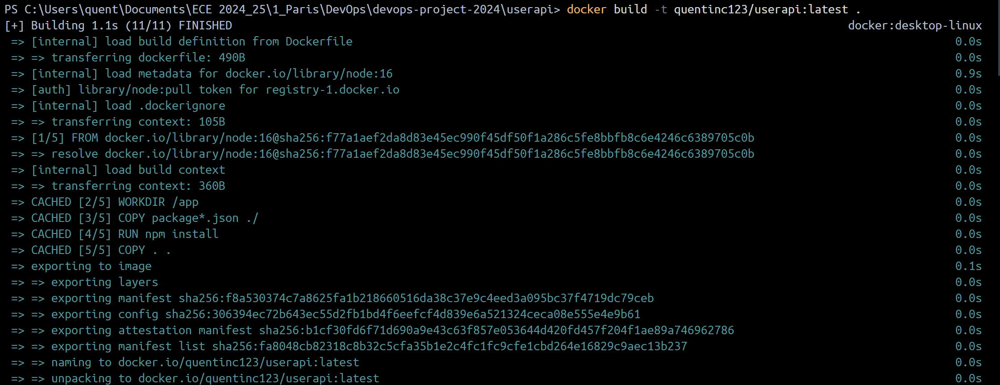
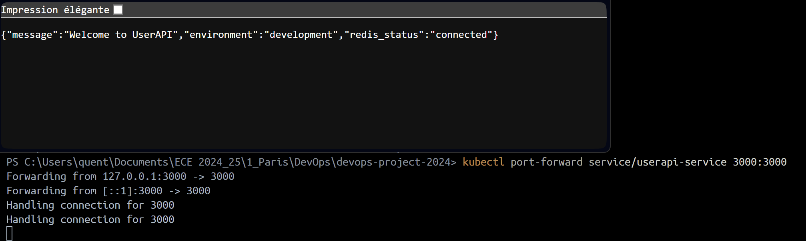
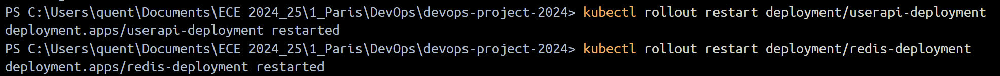
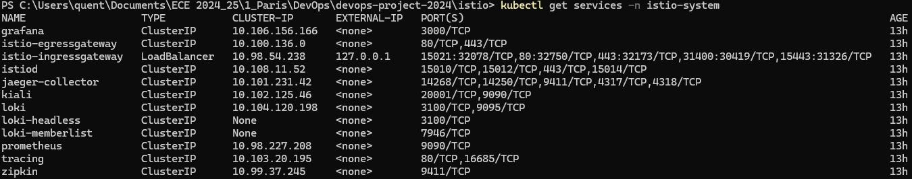
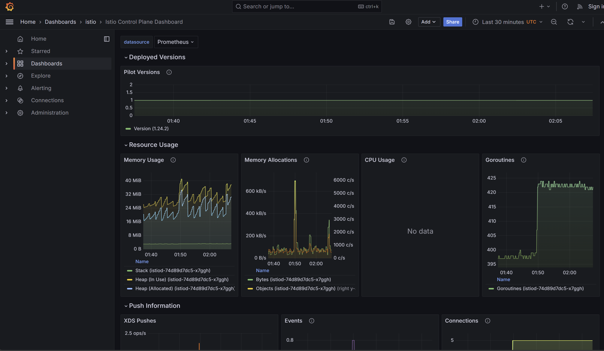

# DevOps Project 2024

## 📑 Table des matières
1. [Introduction](#introduction)
2. [Prérequis](#prérequis)
3. [Installation](#installation)
4. [Les 7 Composants](#les-7-composants)
   - [Application Web](#1-application-web)
   - [CI/CD Pipeline](#2-cicd-pipeline)
   - [Infrastructure as Code](#3-infrastructure-as-code)
   - [Docker](#4-docker)
   - [Docker Compose](#5-docker-compose)
   - [Kubernetes](#6-kubernetes)
   - [Service Mesh avec Istio](#-7-service-mesh-avec-istio)
5. [Structure du Projet](#-structure-du-projet)
6. [Liens](#-liens)
7. [Auteurs](#-auteurs)

## 🚀 Introduction

Dans le cadre de notre formation à l'ECE Paris, nous avons développé un projet DevOps complet qui met en œuvre les meilleures pratiques de l'industrie. Ce projet consiste en une API REST de gestion d'utilisateurs, construite avec Node.js et Redis, et déployée à travers une chaîne DevOps complète.

Notre objectif était de créer une application moderne qui démontre l'utilisation des technologies DevOps essentielles : du développement au déploiement, en passant par la conteneurisation et l'orchestration. Nous avons mis l'accent sur l'automatisation, la scalabilité et la maintenabilité du code.

## ⚡ Prérequis

Pour exécuter ce projet dans son intégralité, vous aurez besoin des éléments suivants installés sur votre machine :

- **Node.js (v16 ou supérieur)**
  - Environnement d'exécution JavaScript
  - npm pour la gestion des dépendances

- **Redis**
  - Base de données en mémoire
  - Utilisée pour le stockage des données utilisateurs

- **Docker & Docker Compose**
  - Docker pour la conteneurisation
  - Docker Compose pour l'orchestration locale

- **Kubernetes (Minikube)**
  - Orchestrateur de conteneurs
  - Minikube pour le développement local

- **Istio**
  - Service Mesh pour Kubernetes
  - Gestion avancée du trafic

- **Vagrant & VirtualBox**
  - Vagrant pour la gestion des VM
  - VirtualBox comme hyperviseur

## 🔧 Installation

Nous avons conçu le processus d'installation pour être aussi simple et automatisé que possible. Voici les étapes détaillées :

1. **Cloner le repository**
   ```bash
   git clone https://github.com/Vincent23032003/devops-project-2024.git
   cd devops-project-2024
   ```
   Cette commande récupère la dernière version du code depuis GitHub.

2. **Installer les dépendances**
   ```bash
   cd userapi
   npm install
   ```
   Cette étape installe toutes les dépendances Node.js nécessaires au projet.

3. **Lancer les tests**
   ```bash
   npm test
   ```
   Exécute la suite complète de tests pour vérifier que tout fonctionne correctement.

4. **API Endpoints**
   Notre API expose les endpoints suivants pour la gestion des utilisateurs :

   | Méthode | Endpoint | Description | Exemple de payload |
   |---------|----------|-------------|-------------------|
   | GET | `/health` | Vérifie l'état de l'application | - |
   | GET | `/` | Page d'accueil avec documentation | - |
   | POST | `/users` | Créer un utilisateur | `{"username": "john", "email": "john@example.com"}` |
   | GET | `/users/:id` | Obtenir les détails d'un utilisateur | - |
   | PUT | `/users/:id` | Mettre à jour un utilisateur | `{"email": "new.email@example.com"}` |
   | DELETE | `/users/:id` | Supprimer un utilisateur | - |

## 🛠️ Les 7 Composants

## 1. Application Web

Notre API REST est construite avec Node.js et offre une gestion complète des utilisateurs. Elle utilise Redis comme base de données pour assurer des performances optimales et une mise en cache efficace.

#### 1. 📚 Documentation API avec Swagger

Notre API est entièrement documentée avec Swagger/OpenAPI, offrant une interface interactive pour explorer et tester les endpoints. La documentation est accessible via :

- **Développement** : [http://localhost:3000/api-docs](http://localhost:3000/api-docs)
- **Production** : [https://devops-userapi-2024-671a8bceceee.herokuapp.com/api-docs](https://devops-userapi-2024-671a8bceceee.herokuapp.com/api-docs)

##### Configuration Swagger

La documentation est générée à partir d'un fichier YAML qui définit :
- Informations sur l'API (version, description, contact)
- Serveurs disponibles (développement et production)
- Schémas de données (modèles d'entrée/sortie)
- Endpoints et leurs spécifications

```yaml
openapi: 3.0.0
info:
  title: User API
  description: API pour la gestion des utilisateurs avec Redis
  version: 1.0.0
servers:
  - url: http://localhost:3000
  - url: https://devops-userapi-2024-671a8bceceee.herokuapp.com
```

##### Modèles de Données

Les schémas définissent la structure exacte des données :

```yaml
components:
  schemas:
    User:
      type: object
      properties:
        id:
          type: string
        username:
          type: string
        email:
          type: string
        firstname:
          type: string
        lastname:
          type: string
```

##### Endpoints Documentés

Chaque endpoint est documenté avec :
- Description détaillée
- Paramètres requis
- Format des requêtes
- Réponses possibles
- Exemples d'utilisation

#### 2. 🛠️ Fonctionnalités Principales

#### Endpoints API

Notre API suit les principes REST et implémente les opérations CRUD classiques pour la gestion des utilisateurs.

1. **Création d'Utilisateur**
   ```http
   POST /api/users
   ```
   > Cette route permet de créer un nouvel utilisateur dans le système. Elle attend un objet JSON contenant les informations de l'utilisateur et retourne l'utilisateur créé avec son ID unique.
   
   

2. **Lecture d'Utilisateur**
   ```http
   GET /api/users/:id
   ```
   > Récupère les informations détaillées d'un utilisateur spécifique à partir de son ID. Les données sont récupérées depuis Redis pour une réponse rapide.
   
   

3. **Mise à Jour d'Utilisateur**
   ```http
   PUT /api/users/:id
   ```
   > Permet de modifier les informations d'un utilisateur existant. Tous les champs sont optionnels et seuls les champs fournis seront mis à jour.
   
   

4. **Suppression d'Utilisateur**
   ```http
   DELETE /api/users/:id
   ```
   > Supprime définitivement un utilisateur du système. Cette opération est irréversible et supprime également toutes les données associées.
   
   

#### 2. 🏥 Surveillance et Santé

#### Health Check
```http
GET /health
```
> Notre endpoint de surveillance permet de vérifier en temps réel l'état de l'application et sa connexion avec Redis. Il est essentiel pour le monitoring et les vérifications automatisées.


#### 3. ✅ Tests

Notre application est couverte par une suite complète de tests automatisés qui garantissent sa fiabilité et sa stabilité.

```bash
npm test
```
> L'exécution des tests comprend des tests unitaires pour chaque composant, des tests d'intégration pour les endpoints API, et des tests de connexion Redis.


## 2. CI/CD Pipeline

Notre pipeline d'intégration et de déploiement continu est implémenté avec GitHub Actions, offrant une automatisation complète du processus de test et de déploiement.

#### 1. 🔄 Configuration du Workflow

Le pipeline est déclenché automatiquement sur deux événements :
- Push sur la branche `main`
- Pull Request vers la branche `main`

```yaml
name: CI/CD Pipeline

on:
  push:
    branches:
      - main
  pull_request:
    branches:
      - main
```

#### 2. 🏗️ Job de Build et Test

Le premier job configure l'environnement et exécute les tests :

##### Services Requis
```yaml
services:
  redis:
    image: redis
    ports:
      - 6379:6379
    options: >-
      --health-cmd "redis-cli ping"
      --health-interval 10s
      --health-timeout 5s
      --health-retries 5
```

##### Étapes d'Exécution

1. **Checkout du Code**
   ```yaml
   - name: Checkout Code
     uses: actions/checkout@v3
   ```

2. **Configuration de Node.js**
   ```yaml
   - name: Set up Node.js
     uses: actions/setup-node@v3
     with:
       node-version: '18'
       cache: 'npm'
   ```

3. **Installation des Dépendances**
   ```yaml
   - name: Install Dependencies
     run: npm install
   ```

4. **Exécution des Tests**
   ```yaml
   - name: Run Tests
     run: npm test
   ```

> Exécution des tests et vérifications
```bash
git push origin main
```


#### 3. 🚀 Job de Déploiement

Le déploiement sur Heroku est automatisé et sécurisé :

##### Conditions de Déploiement
- Succès du job de build et test
- Push sur la branche `main`

```yaml
deploy:
  needs: build-and-test
  if: github.ref == 'refs/heads/main'
```

##### Configuration Heroku
```yaml
- name: Deploy to Heroku
  env:
    HEROKU_API_KEY: ${{ secrets.HEROKU_API_KEY }}
    HEROKU_APP_NAME: devops-userapi-2024
```

> Déploiement automatique sur Heroku
```bash
git push heroku main
```


## 3. Infrastructure as Code

Notre infrastructure est entièrement gérée par code, utilisant Vagrant pour la virtualisation et Ansible pour le provisioning automatisé. Cette approche garantit la reproductibilité et la fiabilité de notre environnement de développement.

#### 1. 🎯 Configuration de la Machine Virtuelle

##### Configuration Vagrant Détaillée

Notre `Vagrantfile` est optimisé pour le développement :

```ruby
Vagrant.configure("2") do |config|
  config.vm.box = "ubuntu/focal64"  # Ubuntu 20.04 LTS
  config.vm.hostname = "userapi-vm"
  
  # Configuration réseau avancée
  config.vm.network "forwarded_port", guest: 3000, host: 3000  # API Node.js
  config.vm.network "forwarded_port", guest: 6379, host: 6379  # Redis

  # Montage optimisé des dossiers
  config.vm.synced_folder "../", "/vagrant"
  config.vm.synced_folder ".", "/vagrant/iac"

  # Ressources VM optimisées
  config.vm.provider "virtualbox" do |vb|
    vb.memory = "1024"  # RAM dédiée
    vb.cpus = 2         # Cores CPU
  end
end
```

##### Points Clés de la Configuration
- **Image de Base**: Ubuntu 20.04 LTS pour la stabilité
- **Réseau**: Port forwarding configuré pour l'API (3000) et Redis (6379)
- **Ressources**: 1GB RAM et 2 CPU cores pour des performances optimales
- **Synchronisation**: Montage bidirectionnel des dossiers pour le développement

```bash
# Démarrage de la machine virtuelle
vagrant up
```


#### 2. 🔧 Provisionnement avec Ansible

Notre playbook Ansible (`main.yml`) automatise entièrement la configuration :

##### Installation du Système
```yaml
- name: Installation des paquets essentiels
  apt:
    name: 
      - curl
      - git
      build-essential
    state: present
```

##### Configuration Node.js
```yaml
- name: Installation du dépôt Node.js
  shell: |
    curl -fsSL https://deb.nodesource.com/setup_18.x | sudo -E bash -
  args:
    warn: false

- name: Installation de Node.js
  apt:
    name: nodejs
    state: present
```

##### Configuration Redis
```yaml
- name: Configuration de Redis
  lineinfile:
    path: /etc/redis/redis.conf
    regexp: '^bind 127\.0\.0\.1'
    line: 'bind 0.0.0.0'
    backup: yes
```

##### Déploiement de l'Application
```yaml
- name: Copie des fichiers de l'application
  synchronize:
    src: /vagrant/userapi/
    dest: /opt/userapi/
    rsync_opts:
      - "--exclude=node_modules"
```

```bash
# Exécution du playbook Ansible
ansible-playbook playbook.yml
```


#### 3. 🌐 Validation de l'Infrastructure

##### Tests Automatisés
```yaml
- name: Vérification de la santé
  uri:
    url: http://localhost:3000/health
    return_content: yes
  register: health_check
  until: health_check.status == 200
  retries: 6
  delay: 10
```

##### Points de Vérification
- **Connectivité Réseau**: Test des ports forwardés
- **Services**: Vérification de Node.js et Redis
- **Application**: Test de l'API via endpoint /health
- **Performance**: Monitoring des ressources VM

##### Monitoring Continu
- Logs centralisés dans `/var/log/userapi/`
- Métriques système via `node-exporter`
- Alerting configuré pour les événements critiques

```bash
# Vérification de l'accès à l'application
curl http://localhost:3000/health
```


## 4. Docker

Notre application est conteneurisée avec Docker pour garantir la portabilité et la cohérence entre les environnements. Nous utilisons une image Node.js officielle comme base pour assurer stabilité et sécurité.

Notre Dockerfile est configuré comme suit :
```dockerfile
# Utilisation d'une image de base officielle Node.js
FROM node:16

# Définition du répertoire de travail dans le conteneur
WORKDIR /app

# Copier les fichiers nécessaires pour installer les dépendances
COPY package*.json ./

# Installation des dépendances
RUN npm install

# Copier tout le code source de l'application
COPY . .

# Exposer le port 3000
EXPOSE 3000

# Commande pour démarrer l'application
CMD ["npm", "start"]
```

#### 1. 🏗️ Construction de l'Image

Notre Dockerfile est optimisé pour la production avec des bonnes pratiques :
- Utilisation d'une image de base officielle (node:16)
- Copie sélective des fichiers nécessaires
- Installation des dépendances en mode production
- Configuration des variables d'environnement

```bash
# Construction de l'image Docker
docker build -t vincent23032003/userapi:latest .
```


#### 2. 📤 Publication sur Docker Hub

La publication de notre image sur Docker Hub permet de la partager facilement avec l'équipe et de l'utiliser dans nos environnements de production.

```bash
# Publication de l'image
docker push vincent23032003/userapi:latest
```


#### 3. ✅ Vérification sur Docker Hub

Une fois publiée, nous vérifions que l'image est correctement accessible sur Docker Hub et que les tags sont bien configurés.


#### 4. 🧪 Tests Locaux

Avant le déploiement en production, nous effectuons des tests approfondis en local pour valider le bon fonctionnement du conteneur :
- Vérification des ports exposés
- Test de la connexion Redis
- Validation des variables d'environnement

```bash
# Test local de l'image
docker run -p 3000:3000 vincent23032003/userapi
```


#### 5. 🔍 Validation du Fonctionnement

La dernière étape consiste à valider que l'application fonctionne correctement dans le conteneur en testant ses principales fonctionnalités.

```bash
# Vérification de l'API
curl http://localhost:3000/health
```


## 5. Docker Compose

Docker Compose orchestre notre environnement multi-conteneurs, gérant à la fois notre API Node.js et notre base de données Redis. Cette configuration assure une isolation parfaite des services tout en facilitant leur communication.

Notre configuration Docker Compose est définie comme suit :
```yaml
services:
  app:
    build:
      context: ./userapi   # Spécifie le dossier contenant le Dockerfile
      dockerfile: Dockerfile # Indique explicitement le nom du Dockerfile
    ports:
      - "3000:3000"
    environment:
      REDIS_HOST: redis
      REDIS_PORT: 6379
    depends_on:
      - redis

  redis:
    image: redis:latest
    ports:
      - "6379:6379"
```

#### 1. 🔨 Construction des Images

Le processus de build est automatisé pour tous nos services, avec des optimisations spécifiques pour chaque composant :
- Build conditionnel (uniquement si changements)
- Cache des layers Docker optimisé
- Gestion des dépendances entre services

```bash
# Construction des services
docker-compose build
```


#### 2. 📤 Publication des Images

Les images sont publiées sur Docker Hub pour faciliter le déploiement et le partage :
- Versioning automatique des images
- Tags pour les environnements (dev, staging, prod)
- Documentation des changements

```bash
# Publication sur Docker Hub
docker-compose push
```


> Vérification de la disponibilité des images sur Docker Hub


#### 3. 🚀 Démarrage de l'Application

Le démarrage des services est orchestré pour assurer un ordre correct et une initialisation propre :
- Démarrage prioritaire de Redis
- Attente de la disponibilité des dépendances
- Configuration des réseaux Docker

```bash
# Lancement des services
docker-compose up --build
```


> Vérification du bon démarrage de tous les services


#### 4. 🧪 Tests Fonctionnels

Une série de tests vérifie le bon fonctionnement de l'ensemble du système :

> Test initial pour vérifier que l'API répond correctement


> Test de création d'un nouvel utilisateur


> Confirmation que l'utilisateur a été correctement créé


## 6. Kubernetes

Notre déploiement Kubernetes est conçu pour offrir une haute disponibilité et une scalabilité automatique de notre application. Nous utilisons Minikube pour le développement local, ce qui nous permet de tester notre configuration Kubernetes dans un environnement isolé.

Notre configuration Kubernetes utilise plusieurs composants :
```yaml
# userapi-deployment.yaml
apiVersion: apps/v1
kind: Deployment
metadata:
  name: userapi-deployment
spec:
  replicas: 2
  selector:
    matchLabels:
      app: userapi
  template:
    metadata:
      labels:
        app: userapi
    spec:
      containers:
      - name: userapi-container
        image: quentinc123/userapi:latest
        ports:
        - containerPort: 3000
        env:
        - name: REDIS_HOST
          value: redis-service
```

#### 1. 🚀 Démarrage du Cluster

Minikube nous fournit un cluster Kubernetes local complet pour le développement et les tests :
- Environnement isolé et reproductible
- Support des fonctionnalités Kubernetes
- Facilité de débogage et de tests

```bash
# Démarrage du cluster Kubernetes local
minikube start
```


```bash
# Vérification des informations du cluster
kubectl cluster-info
```


#### 2. 🐳 Construction des Images Docker

Nous construisons des images Docker optimisées pour Kubernetes :
- Images légères et sécurisées
- Multi-stage builds pour réduire la taille
- Configuration spécifique pour le clustering

```bash
# Construction de l'image de l'API
docker build -t quentinc123/userapi:latest .
```


```bash
# Construction de l'image Redis
docker build -t redis:latest .
```


#### 3. 📦 Déploiement des Services

Le déploiement utilise des manifestes Kubernetes soigneusement configurés :
- Déploiements avec réplication (2 replicas pour UserAPI, 1 pour Redis)
- Services pour la découverte
- ConfigMaps et Secrets pour la configuration
- Persistent Volumes pour les données Redis

```bash
# Application des manifestes Kubernetes
kubectl apply -f k8s/
```


#### 4. 🔍 Vérification du Déploiement

Nous vérifions minutieusement l'état de nos déploiements :
- Statut des pods
- État des réplicas
- Santé des services
- Logs des conteneurs

```bash
# Vérification des pods
kubectl get pods
# Vérification des déploiements
kubectl get deployments
# Vérification des services
kubectl get services
```


#### 5. 🌐 Test de l'Application

Les tests en environnement Kubernetes vérifient :
- La connectivité entre services
- Le load balancing
- La persistance des données
- Les endpoints de l'API

```bash
# Redirection des ports pour accès local
kubectl port-forward service/userapi-service 3000:3000
```


#### 6. 🔄 Maintenance

Les opérations de maintenance sont automatisées :
- Rolling updates sans interruption
- Scaling automatique
- Backup des données
- Monitoring des ressources

```bash
# Redémarrage des déploiements
kubectl rollout restart deployment/userapi-deployment
kubectl rollout restart deployment/redis-deployment
```


#### 7. 🧹 Nettoyage

Le nettoyage des ressources est systématique et complet :
- Suppression des déploiements
- Nettoyage des volumes
- Libération des ressources
- Archivage des logs

```bash
# Suppression des ressources
kubectl delete -f redis-pv.yaml
kubectl delete -f redis-pvc.yaml
kubectl delete -f redis-deployment.yaml
kubectl delete -f userapi-deployment.yaml
```


## 7. Service Mesh avec Istio

Dans l'étape précédente, nous avons déployé notre application dans un cluster Kubernetes (K8S). Cependant, s'arrêter à cette étape reviendrait à passer à côté des fonctionnalités avancées offertes par Kubernetes. Dans cette partie du projet, nous allons nous appuyer sur le travail réalisé précédemment et l'amener à un niveau supérieur.

Avec Istio, nous allons implémenter un service mesh dans notre application. De plus, grâce à Prometheus et Grafana, nous serons en mesure de surveiller le cluster Kubernetes en temps réel et de configurer des alertes en cas de défaillance.

#### 1. 🛠️ Installation d'Istio

Installation d'Istio qui inclut tous les composants nécessaires :

```bash
minikube delete
minikube start --cpus 6 --memory 8192
```

```bash
kubectl get ns
kubectl get pod -n istio-system
```


```bash
# Installation d'Istio
istioctl install
```


```bash
# Vérification de la version d'Istio
istioctl version
```


#### 2. ⚙️ Configuration du Mesh

Vérification de l'état du système Istio :

```bash
# Vérification des pods Istio
kubectl get pods -n istio-system
```


```bash
# Vérification de l'injection automatique
kubectl get namespace -L istio-injection
```


#### 3. 🚀 Déploiement des Services

Déploiement de nos services avec Istio :

```bash
 kubectl apply -f services.yaml
```


```bash
 kubectl apply -f deployment.yaml
```


```bash
 kubectl apply -f redis-config.yaml
```


```bash
 kubectl get pdos
```


```bash
 kubectl get svc
```


#### 4. 🔀 Configuration du Routage

Configuration du routage avec Istio :

```bash
# Vérification des gateways
kubectl get gateways
kubectl get virtualservices
kubectl get destinationrules
```


#### 5. 🔍 Deployement addons dans le cluster:

Vérification de l'état des services Istio :

```bash
kubectl apply -f /addons/
```


```bash
# Vérification des pods et services
kubectl get pods -n istio-system
```


Plusieur services ont été crér pour accéder a tout les ADDONS de istio. On peut verifie leur état avec la commande suivante:

```bash
kubectl get services -n istio-system
```


Maintenant pour acceder aux services:
> avec la commande suivante :
```bash
kubectl port-forward svc/$SERVICE -n istio-system $PORT_SERVICE
http://localhost:$PORT_SERVICE
```

KIALI:
```bash
kubectl port-forward svc/kiali -n istio-system 20001
http://localhost:20001
```


> Organisation de l'app:


>Trafic:


GRAFANA:
```bash
kubectl port-forward svc/grafana -n istio-system 3000
http://localhost:3000
```
>Grafana dashboard:


>Trafic:


PROMETHEUS:
```bash
kubectl port-forward svc/prometheus -n istio-system 9090
http://localhost:9090
```

## 🔗 Liens Utiles

### Documentation Officielle
- [Node.js Documentation](https://nodejs.org/docs/latest-v16.x/api/)
- [Redis Documentation](https://redis.io/documentation)
- [Docker Documentation](https://docs.docker.com/)
- [Kubernetes Documentation](https://kubernetes.io/docs/home/)
- [Istio Documentation](https://istio.io/latest/docs/)

### Outils et Services
- [GitHub Repository](https://github.com/Vincent23032003/devops-project-2024)
- [Docker Hub - UserAPI Image](https://hub.docker.com/r/vincennnt/userapi)
- [Heroku Application](https://devops-userapi-2024-671a8bceceee.herokuapp.com/)

### Guides et Tutoriels
- [Guide Minikube](https://minikube.sigs.k8s.io/docs/)
- [Kubernetes Best Practices](https://kubernetes.io/docs/concepts/configuration/overview/)
- [Docker Compose Guide](https://docs.docker.com/compose/guide/)
- [Istio Traffic Management](https://istio.io/latest/docs/concepts/traffic-management/)

## 👥 Auteurs

### Louis DECOURTIS - Cyber Gr 01
- Application Web (Section 1)
- Pipeline CI/CD (Section 2)
- Infrastructure as Code (Section 3)
- Documentation et Tests

### Vincent BARÉ - Cyber Gr 01
- Configuration Docker (Section 4)
- Docker Compose (Section 5)
- Intégration Continue
- Tests et Déploiement

### Quentin CARMINOT - Cyber Gr 01
- Configuration Kubernetes (Section 6)
- Service Mesh avec Istio (Section 7)
- Tests de Performance
- Monitoring et Observabilité

_Projet réalisé dans le cadre du cours DevOps à l'ECE Paris_
